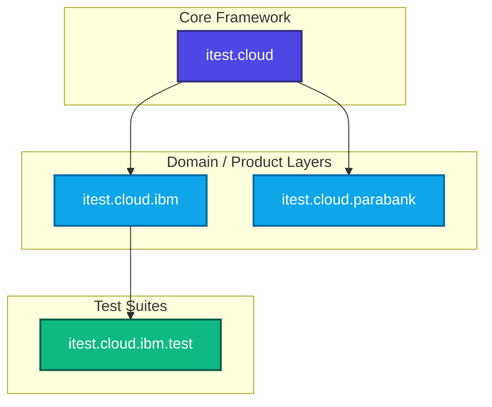

# Automated UI Testing Framework Design Document

This document outlines the architecture, design patterns, and overall design of the `iTestCloud` automated UI testing framework.

---

## 1. High-Level Architecture

The testing ecosystem is split into three main layers to separate core test framework utilities, domain-specific application knowledge, and the actual test scenarios.

| Project / Component | Layer | Description |
| :--- | :--- | :--- |
| **`itest.cloud`** | **Core Framework** | Standard Selenium wrappers, base Page Object classes, browser configurations, generic scenarios, step runners, and environment topologies. |
| **`itest.cloud.ibm`** | **Domain Extension (IBM)** | Extends the core framework with IBM-specific widgets, patterns, standard layouts, and common page templates. |
| **`itest.cloud.parabank`** | **Domain Extension (Parabank)** | Extends the core framework with page objects and topologies tailored for the Parabank test application. |
| **`itest.cloud.ibm.test`** | **Test Suites** | Concrete test scenarios, regression suites, smoke tests, and execution steps for IBM products. |

---

## 2. Core Framework Concepts (`itest.cloud`)

### 2.1 Browser Wrapper & Driver Management (`Browser`)
The `Browser` class manages the lifecycle of the Selenium WebDriver instance. It handles:
- Opening browser sessions (Chrome, Firefox, Android Emulators).
- Custom download directory configurations.
- Taking automatic screenshots/snapshots upon test failures.
- Executing custom JavaScript scripts.

### 2.2 Page Object Model (POM)
The framework uses a strict Page Object Model to separate test logic from UI layout.

- **`IPage`**: The base interface defining essential page capabilities (e.g., getting URLs, loading verification).
- **`Page`**: The abstract class implementing `IPage`. It encapsulates browser interaction, scrolling, waiting for elements, and page transitions.
- **`BrowserElement`**: A powerful wrapper around Selenium's `WebElement`. It resolves common automation issues like `StaleElementReferenceException` by automatically retrying actions.
- **`BrowserDialog`**: Represents modal dialogs overlaying a page. They share characteristics with Pages but are scoped within the active viewport.

---

## 3. Environment Topology (`Topology`)

To ensure tests can run seamlessly across different environments (Dev, Staging, Production), the framework abstracts environment configs:

- **`Topology`**: Represents the server cluster or host configuration. It parses connection details, hostnames, ports, and environment-specific parameters.
- **`Application`**: Represents a specific web application deployed on the topology. It manages:
  - Base URLs.
  - Logging users in/out.
  - User session states.

---

## 4. Scenario Execution (`Scenario`)

Test execution is built around structured, predictable scenarios rather than loose JUnit scripts:

- **`ScenarioRunner`**: The main JUnit wrapper that configures the test run, initializes the topology, sets up browser drivers, and performs teardown.
- **`ScenarioStep`**: Represents an atomic, logical action in the test (e.g., "Login", "Navigate to Dashboard"). It enforces:
  - Execution timeout boundaries.
  - Automatic error handling and logging.
  - Performance metrics logging (e.g., page load times).

---

## 5. Best Practices & Guidelines

> [!IMPORTANT]
> **1. Avoid Thread.sleep()**: Never use hardcoded timeouts. Always use the framework's dynamic wait methods like `waitElement()` or `waitPage()` which check for DOM readiness.
> 
> **2. Reusable Widgets**: If a component (e.g., dropdown, navigation menu) is reused across multiple pages, encapsulate it into a class extending `BrowserElement` instead of duplicating locators.
> 
> **3. Element Retries**: Favor using `BrowserElement` operations over raw Selenium `WebElement` operations. `BrowserElement` will automatically recover from temporary driver glitches.
